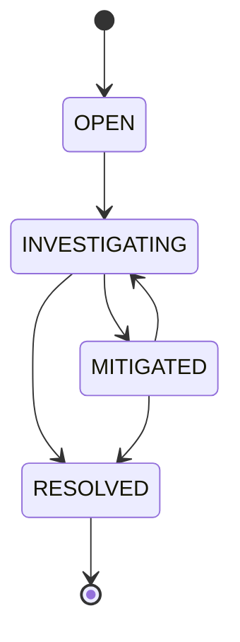

# PulseBoard API

A portfolio-ready **Kotlin + Ktor incident management web application** for tracking operational incidents through a controlled lifecycle.

PulseBoard demonstrates software-engineering fundamentals beyond basic CRUD: layered architecture, domain validation, explicit state transitions, repository abstraction, automated testing, CI, and a REST API built with Ktor.

## Tech stack

- Kotlin 2.4.20
- Ktor 3.6.0
- Java 21
- Gradle Kotlin DSL
- kotlinx.serialization
- Kotlin Test
- GitHub Actions

## What this project demonstrates

- REST API design
- Object-oriented and functional Kotlin
- Separation of concerns
- Repository pattern
- Dependency injection through constructors
- Domain validation and error handling
- State-machine style business rules
- Testable code using injected ID/time providers
- Concurrent in-memory persistence
- Automated CI builds
- Responsive browser dashboard served directly by Ktor
- Incident creation, filtering, status transitions, and deletion from the UI

## Incident lifecycle



## API endpoints

| Method | Endpoint | Description |
|---|---|---|
| GET | `/health` | Service health check |
| GET | `/api/incidents` | List incidents |
| POST | `/api/incidents` | Create an incident |
| GET | `/api/incidents/{id}` | Get one incident |
| PATCH | `/api/incidents/{id}/status` | Change incident status |
| DELETE | `/api/incidents/{id}` | Delete an incident |

## Example request

```bash
curl -X POST http://localhost:8080/api/incidents \
  -H "Content-Type: application/json" \
  -d '{
    "title": "Checkout API outage",
    "description": "Checkout requests are failing with HTTP 500 responses.",
    "severity": "CRITICAL",
    "owner": "platform-team"
  }'
```

Then move it into investigation:

```bash
curl -X PATCH http://localhost:8080/api/incidents/INCIDENT_ID/status \
  -H "Content-Type: application/json" \
  -d '{"status":"INVESTIGATING"}'
```

## Run locally

Requirements:

- JDK 21
- Gradle 9.7.1 or compatible

```bash
git clone https://github.com/Arondith/K-Project.git
cd K-Project
gradle run
```

The application starts on `http://localhost:8080` and serves the PulseBoard dashboard at `/`. The REST API remains available under `/api/incidents`, with `/health` for service health. You can override the port with the `PORT` environment variable.

## Run tests

```bash
gradle test
```

## Project structure

```text
src/
├── main/kotlin/com/arondith/pulseboard/
│   ├── Application.kt
│   ├── model/
│   ├── repository/
│   ├── routes/
│   └── service/
└── test/kotlin/com/arondith/pulseboard/
    └── service/
```

See [docs/ARCHITECTURE.md](docs/ARCHITECTURE.md) for the engineering decisions behind the project.

## Future improvements

- PostgreSQL persistence
- Authentication and role-based access control
- Incident comments and audit history
- Pagination and filtering
- OpenAPI/Swagger documentation
- Metrics and observability
- Deployment to a cloud platform

## Author

**Charles Luke Templonuevo**  
GitHub: [Arondith](https://github.com/Arondith)  
Portfolio: [charles-luke-templonuevo.vercel.app](https://charles-luke-templonuevo.vercel.app/)
